# Admin Design Figma

<table>

  <tr>
    <td width="50%">
      
<strong>Home</strong>

      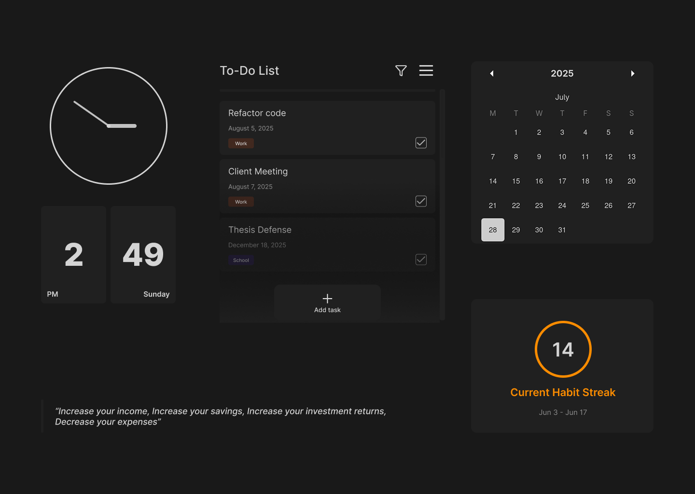
    </td>
    <td width="50%">
      
<strong>Menu</strong>

      
    </td>
  </tr>

  <tr>
    <td>
      
<strong>Security</strong>

      
    </td>
    <td>
      
<strong>JARVIS</strong>

      
    </td>
  </tr>

  <tr>
    <td>
      
<strong>Finance Tracker</strong>

      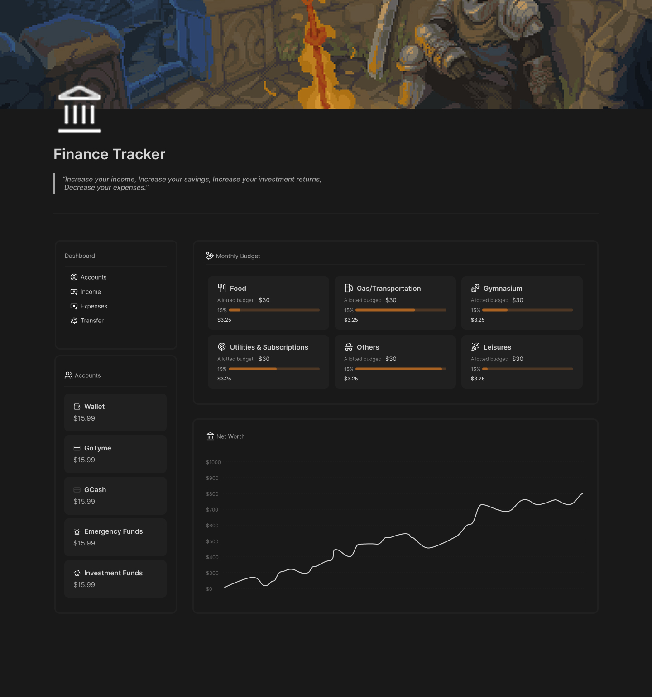
    </td>
     <td>
      
<strong>Finance/Accounts</strong>

      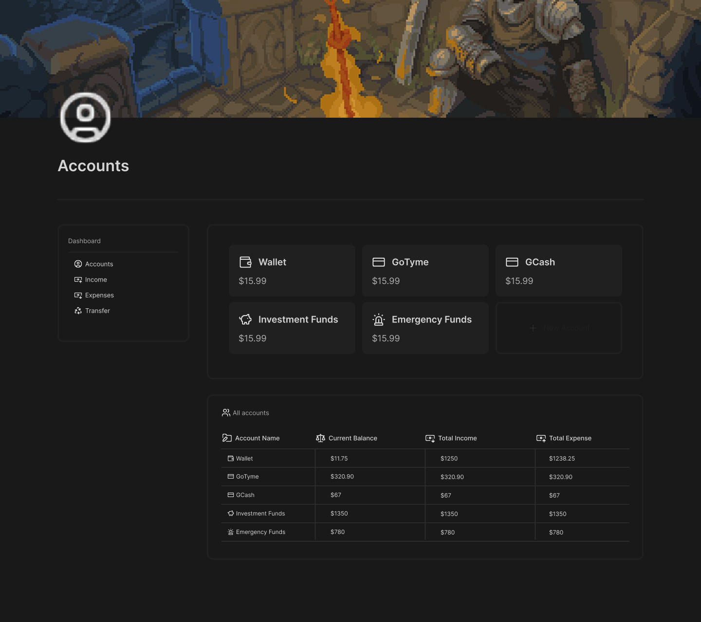
    </td>
  </tr>

   <tr>
    <td>
      
<strong>Finance/Expenses</strong>

      
    </td>
   <td>
      
<strong>Finance/Income</strong>

       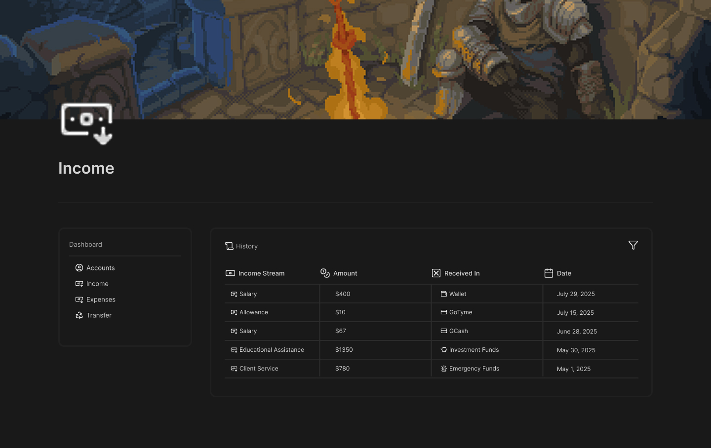
    </td>
  </tr>

   <tr>
    <td>
      
<strong>Finance/Transfer</strong>

      
    </td>
   <td>
      
<strong>Finance Record-Expense</strong>

       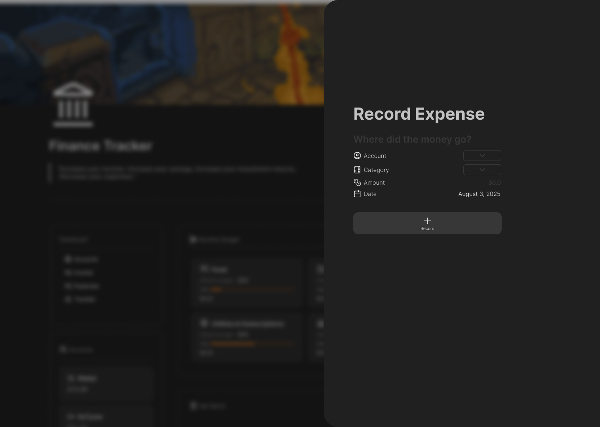
    </td>
  </tr>

  <tr>
     <td>
      
<strong>Finance Record-Income</strong>

       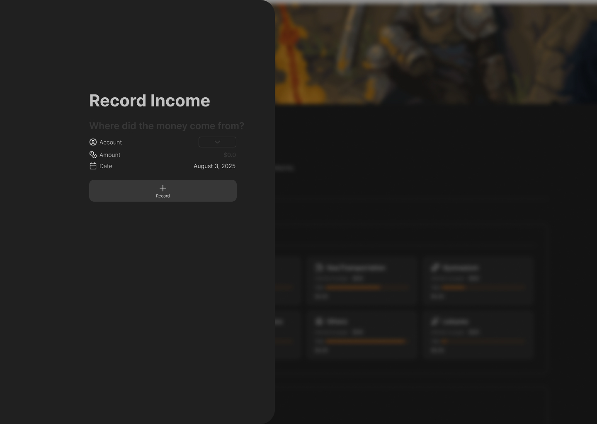
    </td>
     <td>
      
<strong>Finance Record-Transfer</strong>

       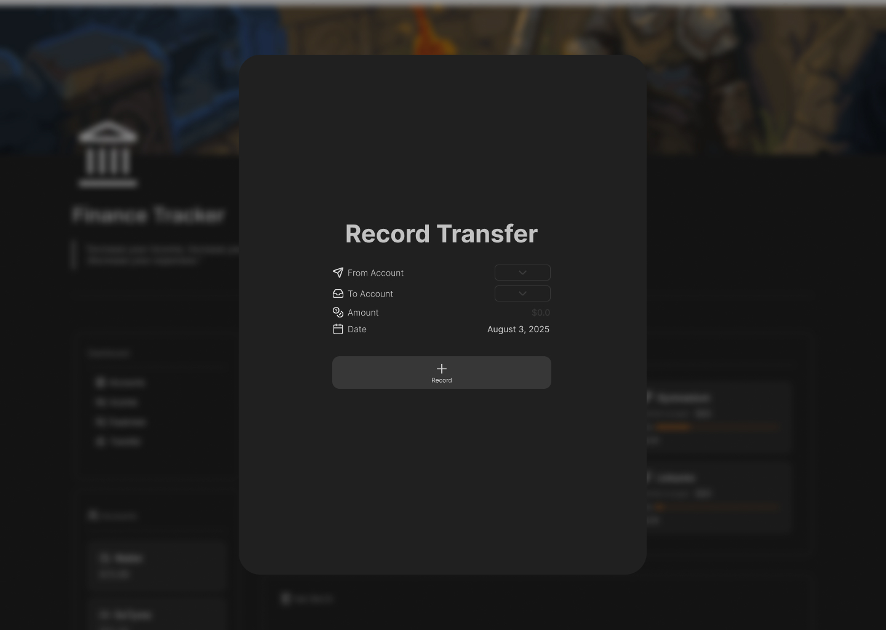
    </td>
  </tr>

   <tr>
     <td>
      
<strong>Habit</strong>

       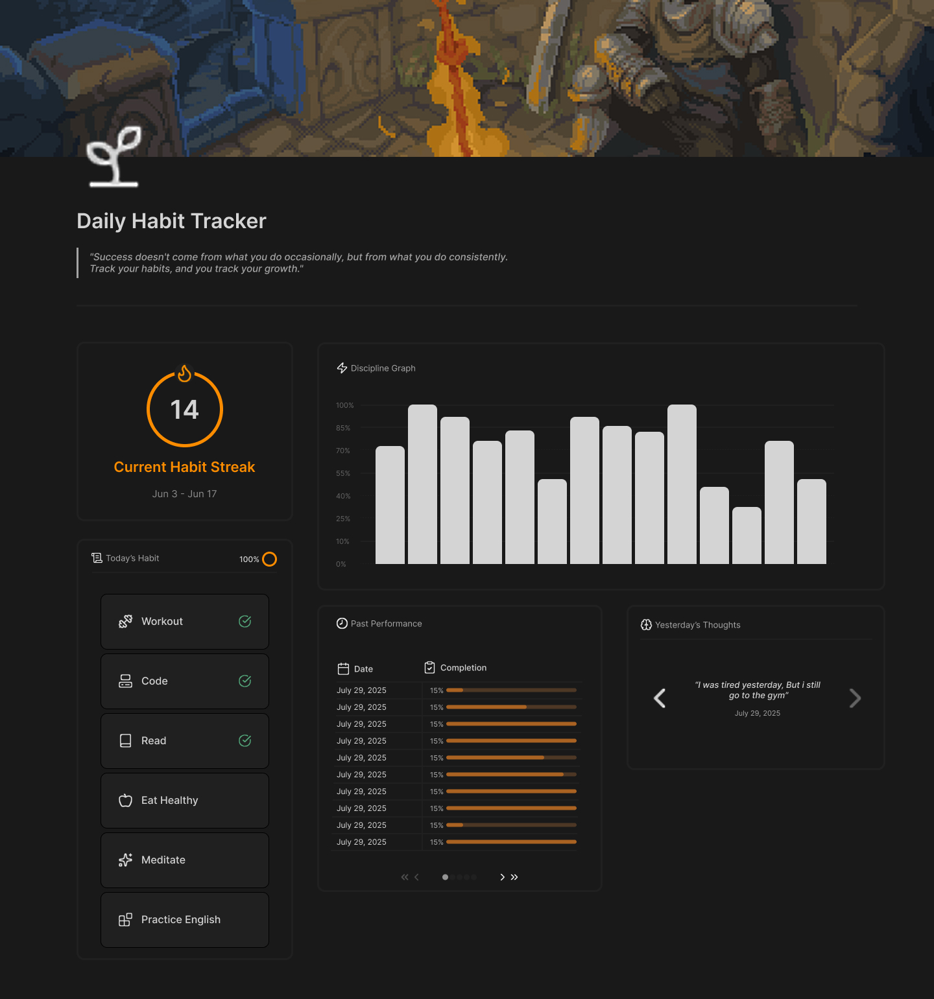
    </td>
     <td>
      
<strong>Record Habit</strong>

       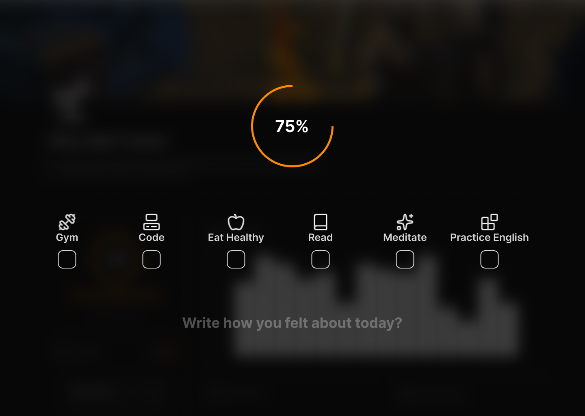
    </td>
  </tr>

   <tr>
     <td>
      
<strong>Settings/Appearance</strong>

       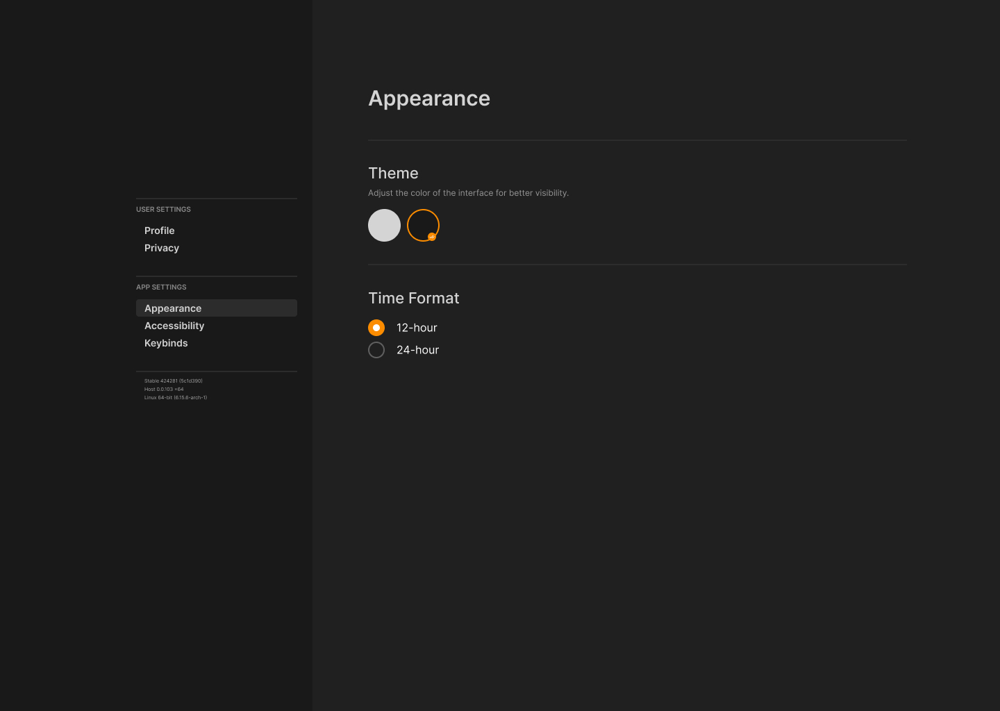
    </td>
     <td>
      
<strong>Settings/Profile</strong>

       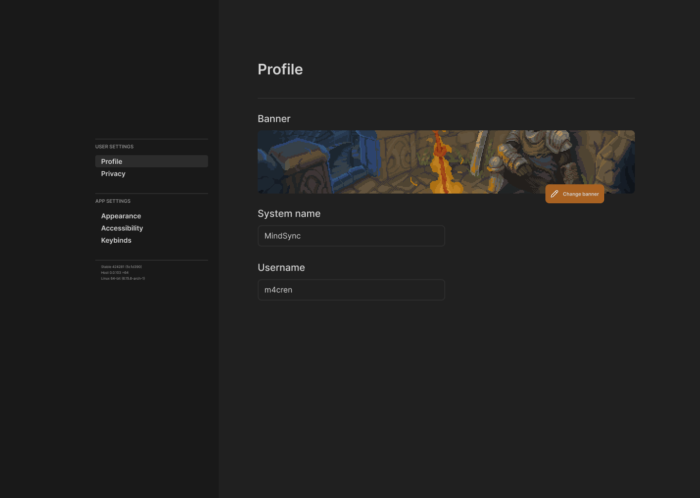
    </td>
  </tr>

   <tr>
     <td>
      
<strong>Settings/Privacy</strong>

       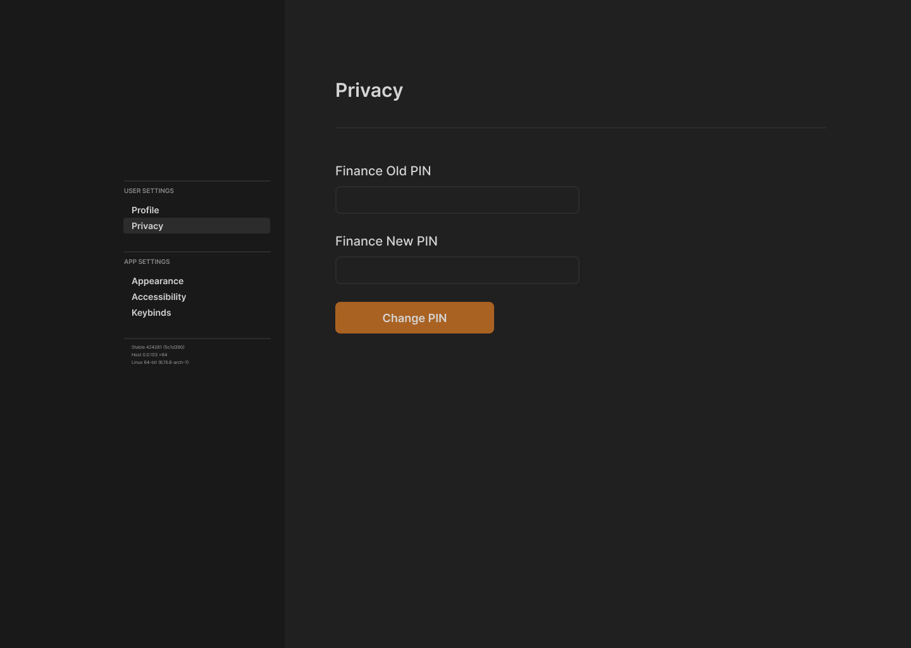
    </td>
    <td>
      
<strong>Settings/Keybinds</strong>

       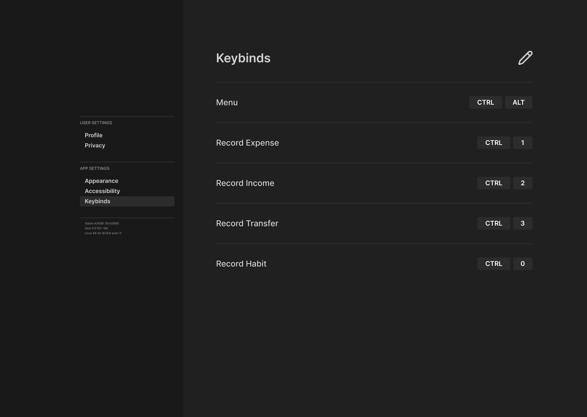
    </td>
  </tr>

   <tr>
     <td>
      
<strong>Settings/Accessibility</strong>

       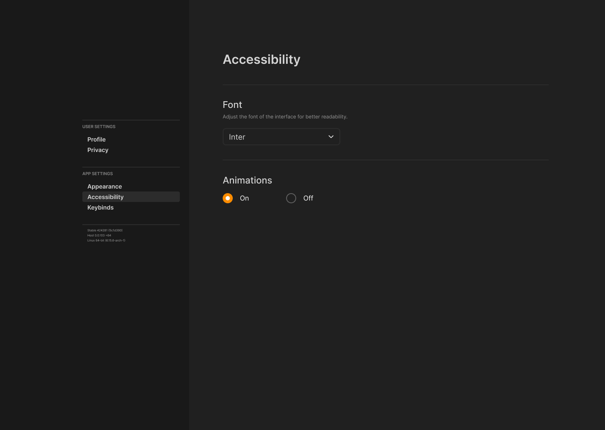
    </td>
  </tr>

</table>
